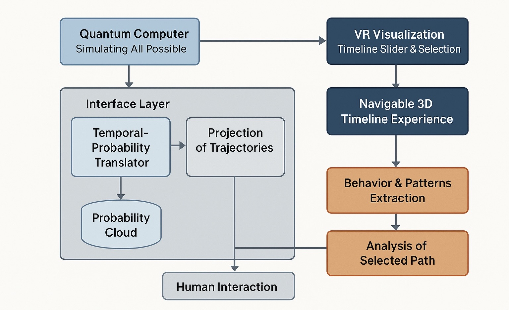

# Quantum-timeline-explorer
A prototype interface for visualizing quantum superposition as a 3D probability timeline.
# Quantum Timeline Explorer  
*Visualizing Quantum Superposition as Navigable Probability Clouds*

---

## Overview

**Quantum Timeline Explorer** is a prototype interface for visualizing the full probability distribution of a quantum computation as a **3D navigable cloud**. Rather than collapsing a quantum system to one output, this project enables users to explore the evolving structure of quantum superposition over time — through spatial, visual, and temporal interaction.

---

## Why This Matters

Traditional quantum computing tools offer only collapsed, single-shot outputs. This project reframes quantum computation as an **interactive field of evolving probability**, helping make quantum logic more human-accessible and extending the use cases of quantum systems — especially for hard optimization problems.

---

## Core Architecture

| Layer | Description |
|-------|-------------|
| **Quantum Backend** | Qiskit-based simulator for running 3–5 qubit circuits (e.g., Grover’s, Bell states) |
| **Probability Cloud Export** | JSON format: each sampled state’s bitstring, frequency, and mapped 3D coordinates |
| **3D Visualization** | Unity or Three.js renders the output as an interactive point cloud with size/color mapped to probability |
| **Timeline Interface** | Optional slider UI to navigate circuit stages, interference development, or amplitude flow |

---

## Current Status

- [x] Project design scoped
- [ ] GitHub repo initialized
- [ ] Qiskit sampling script (Grover’s / Bell)
- [ ] JSON data export script
- [ ] Unity / Three.js visualizer (MVP)
- [ ] Single-slide concept image

---

## Roadmap

- [ ] Create MVP: load Grover circuit, sample 10k shots, export cloud
- [ ] Visualize in Unity or Three.js as 3D points
- [ ] Add time-scrubbing UI for evolving circuit state
- [ ] Collaborate with quantum devs + UI/UX designers
- [ ] Present at Colorado Quantum Forum – May 28

---

## Sample Output Format (WIP)

```json
[
  {
    "bitstring": "000",
    "probability": 0.257,
    "coords": [0.0, 0.0, 0.0]
  },
  {
    "bitstring": "101",
    "probability": 0.154,
    "coords": [1.0, 0.0, 1.0]
  }
]
